# Universal LLM Architecture (Provider-Agnostic Computer Use)

This document describes the new provider-agnostic architecture for our Computer Use agent. It abstracts the LLM provider (Anthropic, OpenAI, etc.) behind a clean interface, preserves a single tool handler surface (our desktop control), and standardizes message/usage models.

## Goals
- Decouple the agent orchestrator and tool handlers from any specific provider SDK
- Support Anthropic Computer Use now, and OpenAI Computer Use (and others) later with minimal code
- Keep the existing action pipeline (`handle_computer_action`) unchanged while migrating the upper layers
- Provide consistent logging, usage/cost reporting, retries, and error handling

## High-Level Overview

```mermaid
flowchart LR
    subgraph Presentation
      A[main.py CLI]
      L[Logger]
    end

    subgraph Core
      O[Orchestrator]
      TR[ToolRegistry]
    end

    subgraph LLM Layer
      LC[LLMClient (interface)]
      AC[AnthropicClient]
      OC[OpenAIClient (skeleton)]
    end

    subgraph Tools
      CT[computer_tool_handler]
      HCA[main.handle_computer_action]
    end

    A --> O
    O --> LC
    LC --> AC
    LC -.future.-> OC

    O --> TR
    TR --> CT
    CT --> HCA

    HCA -->|PyAutoGUI/OS| Desktop
    O --> L
```

## Data Model (DTOs)
Located in `llm/types.py`.
- `Message { role: "system"|"user"|"assistant"|"tool", content: ContentPart[] }`
- `TextPart { type: "text", text: string }`
- `ImagePart { type: "image", media_type: string, data_base64: string }`
- `ToolDescriptor { name: string, kind: "computer_use"|"function", params: dict }`
- `ToolCall { id: string, name: string, args: dict }`
- `ToolResult { tool_call_id: string, content: ContentPart[], is_error: bool }`
- `Usage { input_tokens, output_tokens, provider_raw }`
- `LLMResponse { messages: Message[], tool_calls: ToolCall[], usage: Usage }`

These DTOs provide a unified shape across providers.

## Orchestrator
File: `orchestrator.py`
- Runs the agent loop
- Calls `LLMClient.generate()` with current history and tool descriptors
- Immediately logs assistant text parts (stream-like) via logger (`🧠 ...`)
- Executes each tool call via `ToolRegistry.execute()` and appends provider-formatted tool results
- Logs usage/cost per iteration when enabled (`USAGE_LOG_EACH_ITERATION`)
- Gracefully handles provider errors (esp. Anthropic 429) and logs short, meaningful messages

## Tool Registry and Computer Tool
Files: `tools/registry.py`, `tools/computer.py`
- `ToolRegistry` maps `ToolCall.name` → handler
- `computer_tool_handler` is a thin adapter that forwards to legacy `main.handle_computer_action`
- Default `coordinate_space` is enforced to `"auto"` within the tool handler to properly map model coordinates to screen pixels
- `registry.execute()` normalizes legacy blocks (Anthropic-style dicts) to DTO `ContentPart`s

## Provider Layer
### Interface
File: `llm/interfaces.py`
- `LLMClient.generate(messages, tools, system, ...) -> LLMResponse`
- `LLMClient.format_tool_result(ToolResult) -> Message` (provider-specific representation)

### Anthropic Adapter
File: `llm/adapters_anthropic.py`
- Maps DTOs to Anthropic `beta.messages.create` inputs, using Computer Use tool
- Preserves tool_use/tool_result via special marker parts:
  - `ANTHROPIC_TOOL_USE:[ ... ]`
  - `ANTHROPIC_TOOL_RESULT:[ ... ]`
  The adapter expands these markers back into provider-native blocks upon sending
- Adds request timeout (`API_REQUEST_TIMEOUT_SECONDS`) and custom retry/backoff for 429
- Pretty logs HTTP error bodies (429, etc.), while the orchestrator also handles error surfacing

### OpenAI Adapter (skeleton)
File: `llm/adapters_openai.py`
- Placeholder that returns a simple assistant message
- To implement: map DTO tools to OpenAI Computer Use configuration, and format tool results as `role="tool"` messages with `tool_call_id`

## Dependency Injection
File: `di.py`
- Uses `python-injector` to wire components:
  - `LLMModule` provides `LLMClient` based on `LLM_PROVIDER`
  - `ToolsModule` registers the `computer` tool handler
- `create_container(provider)` returns an Injector instance

## Configuration
File: `config/settings.py`
- Provider selection: `LLM_PROVIDER` = `"anthropic"` | `"openai"`
- Anthropic defaults: `MODEL_NAME`, `COMPUTER_TOOL_TYPE`, `COMPUTER_BETA_FLAG`
- OpenAI defaults: `OPENAI_MODEL_NAME`
- Tooling: `ALLOW_PARALLEL_TOOL_USE`
- Timeouts/Retry/Backoff: `API_REQUEST_TIMEOUT_SECONDS`, `API_MAX_RETRIES`, `API_BACKOFF_BASE_SECONDS`, `API_BACKOFF_MAX_SECONDS`, `API_BACKOFF_JITTER_SECONDS`
- Usage logging: `USAGE_LOG_EACH_ITERATION`
- Virtual display/screenshot/overlay/audio/typing: inherited from legacy, unchanged

## Message Flow (Sequence)

```mermaid
sequenceDiagram
    participant User
    participant Orchestrator
    participant LLMClient
    participant ProviderSDK
    participant ToolRegistry
    participant ComputerTool
    participant LegacyMain as handle_computer_action

    User->>Orchestrator: task
    Orchestrator->>LLMClient: generate(messages, tools, system)
    LLMClient->>ProviderSDK: provider-specific request
    ProviderSDK-->>LLMClient: assistant+tool_use blocks
    LLMClient-->>Orchestrator: LLMResponse (messages + tool_calls)
    Orchestrator->>Orchestrator: log assistant text (🧠)
    loop tool_calls
      Orchestrator->>ToolRegistry: execute(call)
      ToolRegistry->>ComputerTool: call.args
      ComputerTool->>LegacyMain: action params
      LegacyMain-->>ComputerTool: content blocks
      ComputerTool-->>ToolRegistry: ToolResult
      ToolRegistry-->>Orchestrator: ToolResult
      Orchestrator->>LLMClient: format_tool_result(result)
      LLMClient-->>Orchestrator: Message with tool_result
      Orchestrator->>LLMClient: generate(next turn)
    end
```



## Error Handling & Rate Limits
- Anthropic 429: custom retry with exponential backoff (uses `Retry-After` when present)
- If provider still returns 429 after retries, orchestrator logs a concise error and exits the loop cleanly
- Non-429 provider errors are similarly logged with status and response body

## Logging & Usage Cost
- Assistant text parts are logged on arrival (`🧠 ...`) for a stream-like experience
- Per-iteration usage cost is logged when enabled via `USAGE_LOG_EACH_ITERATION`

## Streaming
- Current behavior: pseudo-streaming — prints assistant text blocks immediately after each `generate()`
- Future: add real streaming by using the provider’s streaming API and dispatching streamed events to the logger/UI

## Extending to a New Provider
1. Implement an adapter `NewProviderClient(LLMClient)`
   - Map DTOs to provider inputs/outputs
   - Implement `format_tool_result`
2. Add provider choice in `LLMModule` (DI)
3. Add any provider-specific config keys
4. Write basic unit tests (message mapping, tool calls, error handling)

## Notable Behaviors Preserved from Legacy
- `handle_computer_action` remains the single source of truth for mouse/keyboard/screen actions
- Coordinate mapping: model space → screen space with letterboxing and calibration is unchanged
- Optional post-action screenshots and sounds remain available

## File Map
- `main.py`: CLI entry, sets up logger, builds system prompt, wires orchestration via DI
- `orchestrator.py`: agent loop, streaming logs, usage/cost logging, error handling
- `llm/types.py`: DTOs (messages, tools, usage)
- `llm/interfaces.py`: `LLMClient` interface
- `llm/adapters_anthropic.py`: Anthropic adapter (markers + retries + pretty errors)
- `llm/adapters_openai.py`: OpenAI adapter skeleton
- `tools/registry.py`: registry + normalization
- `tools/computer.py`: tool adapter to `main.handle_computer_action`
- `di.py`: injector wiring
- `config/settings.py`: provider/tool/timeouts/backoff and other knobs

---

This architecture minimizes provider lock-in, keeps the Computer Use pipeline stable, and makes it straightforward to add new providers, strengthen error handling, and introduce real streaming when desired.
